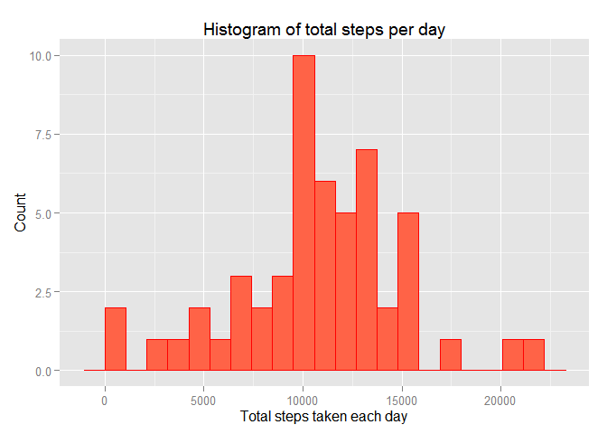
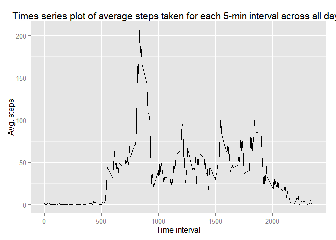

# Reproducible Research: Peer Assessment 1
First, please set the working directory to the source file location.

## Loading and preprocessing the data

```r
#read data from the working directory
myactivity<-read.csv(paste0(getwd(),"/activity/activity.csv"))
```

## What is mean total number of steps taken per day?
1.Total numbers of steps per day:

```r
#Calculate the total numbers of steps per day by function tapply
ttl_spd<-tapply(myactivity$steps,INDEX = myactivity$date,sum)
ttl_spd<-as.data.frame(ttl_spd)
names(ttl_spd)<-c("steps")
print(ttl_spd)
```

```
##            steps
## 2012-10-01    NA
## 2012-10-02   126
## 2012-10-03 11352
## 2012-10-04 12116
## 2012-10-05 13294
## 2012-10-06 15420
## 2012-10-07 11015
## 2012-10-08    NA
## 2012-10-09 12811
## 2012-10-10  9900
## 2012-10-11 10304
## 2012-10-12 17382
## 2012-10-13 12426
## 2012-10-14 15098
## 2012-10-15 10139
## 2012-10-16 15084
## 2012-10-17 13452
## 2012-10-18 10056
## 2012-10-19 11829
## 2012-10-20 10395
## 2012-10-21  8821
## 2012-10-22 13460
## 2012-10-23  8918
## 2012-10-24  8355
## 2012-10-25  2492
## 2012-10-26  6778
## 2012-10-27 10119
## 2012-10-28 11458
## 2012-10-29  5018
## 2012-10-30  9819
## 2012-10-31 15414
## 2012-11-01    NA
## 2012-11-02 10600
## 2012-11-03 10571
## 2012-11-04    NA
## 2012-11-05 10439
## 2012-11-06  8334
## 2012-11-07 12883
## 2012-11-08  3219
## 2012-11-09    NA
## 2012-11-10    NA
## 2012-11-11 12608
## 2012-11-12 10765
## 2012-11-13  7336
## 2012-11-14    NA
## 2012-11-15    41
## 2012-11-16  5441
## 2012-11-17 14339
## 2012-11-18 15110
## 2012-11-19  8841
## 2012-11-20  4472
## 2012-11-21 12787
## 2012-11-22 20427
## 2012-11-23 21194
## 2012-11-24 14478
## 2012-11-25 11834
## 2012-11-26 11162
## 2012-11-27 13646
## 2012-11-28 10183
## 2012-11-29  7047
## 2012-11-30    NA
```

2.Plot the histogram:

```r
#Make a histogram of the total number of steps taken each day
#Call ggplot lib
library(ggplot2)
```

```
## Warning: package 'ggplot2' was built under R version 3.2.2
```

```r
#Plot
range_steps<-range(ttl_spd,na.rm = T)[2]-range(ttl_spd,na.rm = T)[1]
g_hist<-ggplot(ttl_spd,aes(steps))
(g_hist  + geom_histogram(aes(steps),binwidth=range_steps/20,color="red",fill="tomato")
+ labs(x="Total steps taken each day")
+ labs(y="Count")
+ labs(title="Histogram of total steps per day"))
```

 

3.Report the mean and median of steps taken per day:

```r
#mean
mean(ttl_spd$steps,na.rm=T)
```

```
## [1] 10766.19
```

```r
#median
median(ttl_spd$steps,na.rm = T)
```

```
## [1] 10765
```

## What is the average daily activity pattern?
1.Time series plot:

```r
#Calculate the average steps taken for each 5-min interval across all days
avg_sp5_array<-tapply(myactivity$steps,INDEX = as.factor(myactivity$interval),mean,na.rm=T)
#Clean up the data
avg_sp5<-as.data.frame(as.numeric(1:288))
avg_sp5$interval<-as.numeric(names(avg_sp5_array))
avg_sp5$steps<-as.numeric(avg_sp5_array)
names(avg_sp5)<-c("interval_id","interval","steps")

#Plot
library(ggplot2)
g_timeseries<-ggplot(avg_sp5,aes(interval,steps))
(g_timeseries+geom_line()
+ labs(x="Time interval")
+ labs(y="Avg. steps")
+ labs(title="Times series plot of average steps taken for each 5-min interval across all days"))
```

 

2.Which 5-minute interval, on average across all the days in the dataset, contains the maximum number of steps?

```r
#Find the interval contains the maximum steps
id_max<-match(max(avg_sp5$steps),avg_sp5$steps)
avg_sp5[id_max,"interval"]
```

```
## [1] 835
```

## Imputing missing values


## Are there differences in activity patterns between weekdays and weekends?
